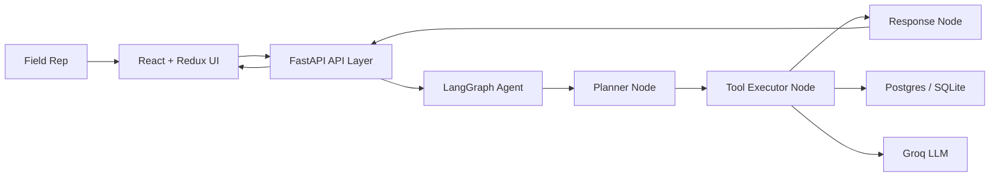
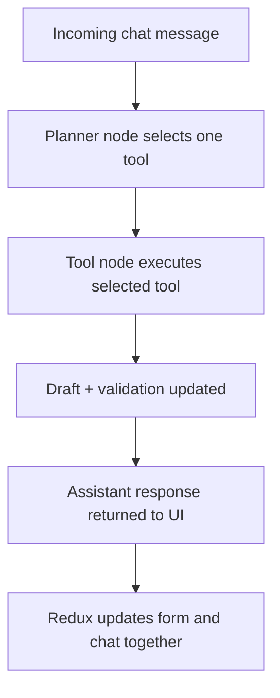

# Architecture Overview

## Goal

Build a split-screen HCP interaction logger where the right-side AI assistant controls the left-side form entirely through natural language.

## System Design

## Frontend

- `frontend/src/App.tsx`: page shell and bootstrap flow.
- `frontend/src/components/FormPanel.tsx`: read-only interaction form that highlights updated fields.
- `frontend/src/components/ChatPanel.tsx`: chat composer, prompt shortcuts, and tool badges.
- Redux slices keep chat, form, validation, and reference data synchronized from backend snapshots.

## Backend

- `backend/app/main.py`: FastAPI entrypoint and routes.
- `backend/app/services.py`: session persistence, reference data, and save operations.
- `backend/app/agent/graph.py`: LangGraph workflow.
- `backend/app/agent/tools.py`: six agent tools.
- `backend/app/agent/llm.py`: Groq-backed JSON extraction plus a mock fallback for local testing.

## LangGraph Workflow

## Tool Inventory

1. `log_interaction`
   Extracts HCP, date, time, sentiment, materials, samples, topics, outcomes, and follow-up actions from a free-text note.

2. `edit_interaction`
   Applies partial updates only to explicitly mentioned fields and preserves everything else.

3. `clear_form`
   Resets the draft to a clean default state.

4. `summarize_interaction`
   Generates an AI summary and suggested next steps for the field rep.

5. `validate_interaction`
   Checks completeness and warns about missing data before save.

6. `save_interaction`
   Persists the current draft into SQL and writes an audit record.

## State Consistency Strategy

- The backend always returns the latest form snapshot after each chat turn.
- Redux writes that snapshot into the form slice and the assistant reply into the chat slice in the same request cycle.
- The form is AI-controlled and read-only, which removes client-side divergence.

## Production Readiness Notes

- Postgres-ready via `docker-compose.yml`.
- SQLite fallback remains enabled for local zero-setup development and tests.
- Reference data is seeded automatically.
- API tests cover bootstrap, log, edit, and save flows.
